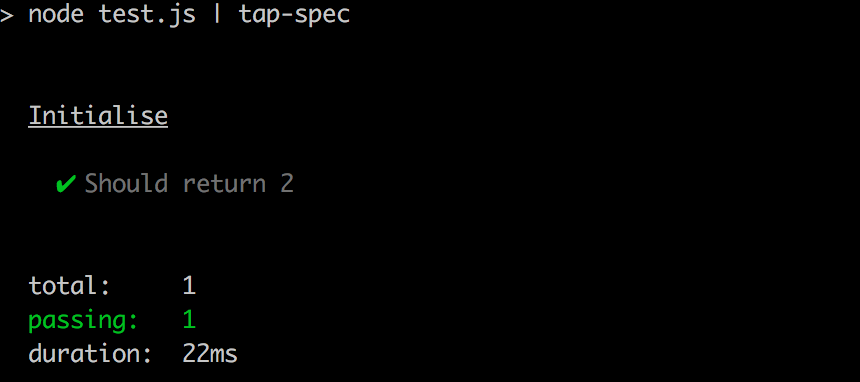
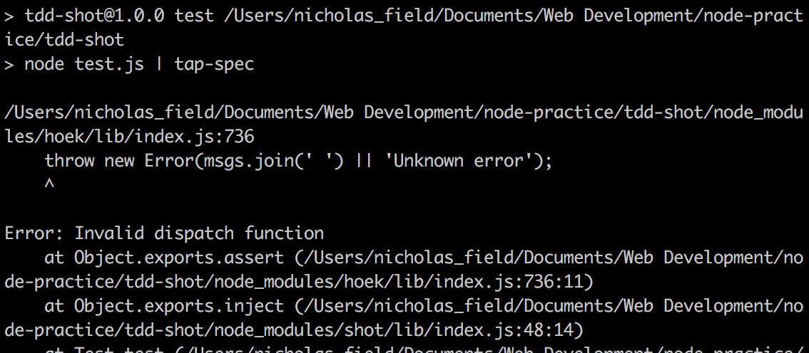
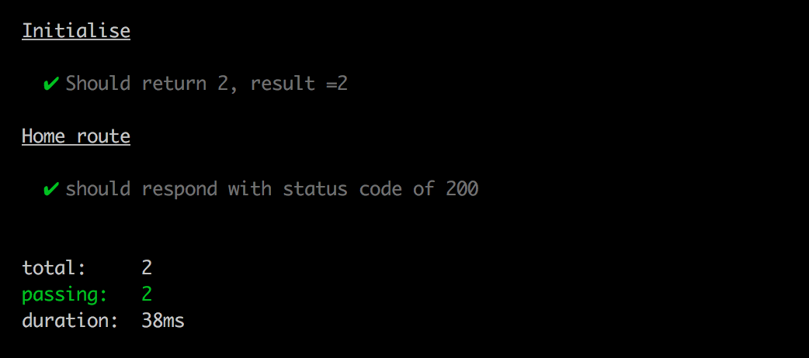

# Test Driven Development Server with Tape and Shot

## Learning Outcomes
To understand the potential of faking requests to your server for the purposes of testing responses.

## Tools

### Tape
[Tape](https://github.com/substack/tape) is an *npm module* used for testing server side code written in Node.js. This workshop will demonstrate using tape results piped through the  [tape-spec module](https://github.com/scottcorgan/tap-spec) to [prettify the test response output](https://github.com/substack/tape#things-that-go-well-with-tape)

### Shot
[Shot](https://github.com/hapijs/shot) is used in this workshop to simulate fake server requests *without* the need to have the server listening via a socket connection to respond to the requests. Fake requests are simply objects passed to your routes;
```javascript
{
  method: 'get',
  url: '/'
}
```
You can view the full request/response values available in shots [demonstration](https://github.com/hapijs/shot).

**Note: In order to test you server you will need ensure your internal server logic (router) is in a separate file from the http server itself. For example;**

```javascript
// router.js
const server = (req, res) => {
  if (req.url == '/') {
    res.writeHead(200, {'content-type' : "text/html"})
    res.end('Hello')
  }
}
module.exports = server;

// server.js
const http = require('http');
const port = process.env.PORT || 4000;
const router = require('./router');

http.createServer(router).listen(port);
console.log('running');
```

# Walkthrough

- Create a new directory and run `npm init` to set up blank project with a package.json.
- Create a server file (not needed in this walkthrough but you might as well);
```
$ touch server.js
```
- Create a router file;
```
$ touch router.js
```
- Install tape, tap-spec and shot as dev dependencies
```
$ npm install tape --save-dev && npm install shot --save-dev && npm install tap-spec --save-dev
```
- Edit your package.json file to set up the following test script
```
"scripts": {
  "test": "node test.js | tap-spec"
}
```
- Create a *test.js* file
- Inside *test.js*, require tape, shot and router.js;
```javascript
const test = require('tape');
const shot = require('shot');
const router = require('./router'); // remember: absolute paths are needed for local modules, and no '.js' extension is needed
```
- Write a test to ensure tape is working;
```javascript
test('Initialise', (t) => {
  let num = 2
  t.equal(num, 2, 'Should return 2');
  t.end(); // Remember to call t.end() after every test call, to ensure tests run in order
})
```
- Run `npm test` in the terminal to check the test is passing-

- Now let's create a failing test to check your router.js logic...
```javascript
// Home Route
test('Home route', (t) => {
  shot.inject(router, { method: 'get', url: '/' }, (res) => {
    t.equal(res.statusCode, 200, 'should respond with status code of 200');
    t.end();
  })
})
```
Here, shot.inject method is given three arguments (1. the router, 2. the fake request object, and a callback function with the response). We've already required in the router, so here we're saying we want to make a **get** request to the home route (**'/'**), and check the **status code** of the response in the form of *res.statusCode*.

We're using tape's t.equal method which takes an initial argument, a comparison argument, and a string containing a message that should describe the test, and t.equal will only success if the two arguments are equal.

Now when you run `npm test` you should see the following error;

**Invalid dispatch function explained:** - the 'dispatch function' is simply the first argument that shot.inject expects. It is simply the function which the fake request object will be sent into, i.e. your router.js file. So shot is returning an error here with **Invalid dispatch function** as the dispatch function we've given (the contents of router.js) is undefined. Router.js needs to return a function which can take a request and return a response, so let's fix this failing test...
- In router.js, add a function called router, that includes arguments *request* and *response*
```javascript
const router = (request, response) => {
}
```
And **export the router function**;
```javascript
module.exports = router
```
- Add an *if* branch, the condition should be if the url property of the request object matches '/';
```javascript
const router = (request, response) => {
  if (request.url == '/') {
  }
}
```
- Next, inside this branch, call the *writeHead* method with a response code of **200** and a header object containing the content-type;
```javascript
const router = (request, response) => {
  if (request.url == '/') {
    response.writeHead(200, {'content-type' : "text/html"})
  }
}
```
- Finally, call the *end* method on the response object, and pass in the payload to be sent to the client;
```javascript
const router = (request, response) => {
  if (request.url == '/') {
    response.writeHead(200, {'content-type' : "text/html"})
    respone.end('Hello')
  }
}
```
- Run `npm test` again to validate

- You've written your first passing test of your servers logic, congrats! Now you can build on this test by adding another test to check the response payload;
```javascript
test('Home route', (t) => {
  shot.inject(router, { method: 'get', url: '/' }, (res) => {
    t.equal(res.statusCode, 200, 'should respond with status code of 200');
    t.equal(res.payload, 'Hello', 'should return correct response');
    t.end();
  })
})
```

## Next Steps

There are a wide range of [request methods](https://github.com/hapijs/shot/blob/master/API.md) that you can use with shot to test your server logic. Combined with [tapes testing methods](https://github.com/substack/tape) you can build a robust set of tests to ensure all your server endpoints are tested.

## Exercises

In this repo, I've built on this example by adding more tests and more routes. To build on from what I've created, first follow these install steps;


1. Clone the repo
```
git clone git@github.com:njsfield/tdd-node-server-with-shot-and-tape.git
```
2. Install dependencies
```
npm install
```
3. Run tests (they should be passing)
```
npm test
```

Next, use TDD to add & test the following features :

1. For unknown routes (e.g '/elephants') respond with a status code of 404, and a message 'unknown uri'
2. A new route at '/blog'; if the request method is *get*, respond with a status code of 200, and a JSON object containing an array of three strings...
3. For the new '/blog' route, if the request method is *post* and the request header contains a key of "password" and a value of "potato", should respond with a status code of 200, with a JSON object containing an array of strings that *includes* what was given as the *request* payload.
  - If the method is post, but the password key/value pair is NOT included in the request, respond with a status code of *403*, and the payload string 'Forbidden'.
  - If the method is post, and the password key/value pair IS included, BUT no payload is given in the request, then respond with a status code of *302*, and simply a header containing the key "Location", and value "/blog". This is to simulate redirecting a user back to the '/blog' route if they attempt to submit an empty post.

Good luck :)
